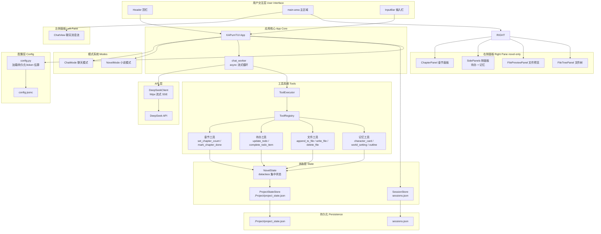
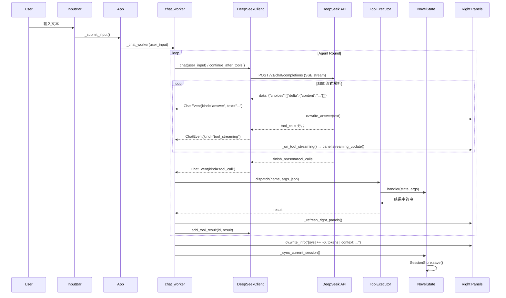

# K.A-purn-tui - 架构设计文档

> v0.2.0 | Python 3.10+ | Textual 0.50+ | httpx | Rich

---

## 系统概览架构图



---

## 核心数据流



---

## 模块分层架构

```
┌─────────────────────────────────────────────────┐
│                   app.py                         │  ← 主应用入口、布局、命令路由、agent 回路
├─────────────┬────────────┬──────────┬───────────┤
│  widgets/   │  panels/   │  modes/  │  api/     │
│  ChatView   │  FilePrev  │  Chat    │  client   │
│  InputBar   │  FileTree  │  Novel   │  (httpx)  │
│  Sessions   │  Chapter   │  (base)  │           │
│             │  SideP     │          │           │
├─────────────┴────────────┴──────────┴───────────┤
│                  tools/                          │  ← 工具定义与执行
│  executor.py  registry.py  chapter_tools.py     │
│  file_tools.py  todo_tools.py  memory_tools.py  │
├─────────────────────────────────────────────────┤
│                  state/                          │  ← 状态管理
│  novel_state.py  project_state.py               │
│  session_store.py                               │
├─────────────────────────────────────────────────┤
│                  config.py                       │  ← 配置加载 / token 估算 / system prompt
└─────────────────────────────────────────────────┘
```

---

## 关键设计决策

### 1. 双模式架构

| 模式 | 类 | 工具 | 右侧面板 | 会话存储 |
|------|-----|------|---------|---------|
| 聊天 `chat` | `ChatMode` | 无 | 隐藏 | 全局 `sessions.json` |
| 小说 `novel` | `NovelMode` | 16 个工具 | ChapterPanel + SidePanels + FilePreviewPanel + FileTreePanel | 项目级 `{project}/.Project/sessions.json` |

### 2. Agent 工具调用回路

```
用户输入 → _chat_worker → _run_agent_round(round_idx=0)
                ↓
    async for ev in client.chat(user_input, tools):
        ├── thinking → cv.write_thinking()
        ├── answer   → cv.write_answer()
        ├── tool_streaming → _on_tool_streaming() → panel.streaming_update()
        └── tool_call → ToolExecutor.dispatch() → 回传 tool result
                ↓
    若有 tool_calls → _run_agent_round(round_idx+1)  # 递归
    无 tool_calls  → end
```

### 3. 上下文管理三档水位

```
上下文占用比例 = (message_tokens + tool_tokens) / 1_000_000

< 60%       正常
60% ~ 80%   警戒 ── 自动精简旧 tool result / 删除旧 reasoning_content
80% ~ 90%   压缩 ── 异步调用模型生成早期对话摘要
≥ 90%       紧急 ── 强制截断，只保留 system + 最近 N 轮
```

### 4. 双级状态隔离

| 级别 | 存储位置 | 内容 | 共享范围 |
|------|---------|------|---------|
| **会话级** | `Session.novel_memory` / `novel_progress` | 人物卡、世界观、大纲、风格、章节摘要、当前章节、待办 | 当前会话独占 |
| **项目级** | `.Project/project_state.json` | 章节总数、章节列表、自定义进度条 | 同项目所有会话共享 |

### 5. 流式文件预览策略

- **RichLog.write()** 每次调用必定创建新显示行
- 采用 **清空 + 按 `\n` 拆行全量重写** 策略
- 每个 `tool_streaming` 事件后执行 `asyncio.sleep(0)` 出让控制权，确保 Textual 帧重绘

### 6. 预删除系统

```
delete_file(path)
    → 立即移动文件到 .pr/pre-delete/
    → 模型仍可通过 read_file('.pr/pre-delete/文件名') 读取

对话结束后:
    用户回复"确认删除"  → perform_delete()  → 回收站
    用户回复其他内容    → restore_pre_deleted() → 恢复原位
    用户无响应          → 文件留在预删除区
```

---

## 目录结构

```
deepseek-tui/
├── ka_purn_tui/               # Python 包
│   ├── __init__.py             # v0.2.0
│   ├── __main__.py             # python -m ka_purn_tui 入口
│   ├── app.py                  # ★ KAPurnTUI(App) 主类
│   ├── config.py               # 配置加载/持久化/token 估算/system prompt
│   ├── commands.py             # 额外命令处理
│   │
│   ├── api/
│   │   └── client.py           # DeepSeekClient (httpx 流式 SSE + tool calling)
│   │
│   ├── modes/
│   │   ├── base.py             # Mode 抽象基类
│   │   ├── chat.py             # ChatMode (无工具/无面板)
│   │   └── novel.py            # NovelMode (16工具 + 4面板)
│   │
│   ├── panels/
│   │   ├── base.py             # BaseRightPanel 基类
│   │   ├── file_preview_panel.py  # ★ 文件实时流式预览 (清空+全量重写)
│   │   ├── file_tree_panel.py     # 项目文件树 (Textual Tree)
│   │   ├── chapter_panel.py       # 章节列表 + 进度条
│   │   └── side_panels.py         # 待办面板 + 常驻记忆面板
│   │
│   ├── tools/
│   │   ├── executor.py            # ToolExecutor: dispatch + summary
│   │   ├── registry.py            # ToolDef + ToolRegistry
│   │   ├── chapter_tools.py       # set_chapter_count / set_current_chapter / mark_chapter_done
│   │   ├── file_tools.py          # create/write/append/edit/delete/rename/move/read_file
│   │   ├── todo_tools.py          # update_todo / add_todo_item / complete_todo_item
│   │   └── memory_tools.py        # character_card / world_setting / outline / style_guide
│   │
│   ├── state/
│   │   ├── novel_state.py         # ★ NovelState dataclass (核心状态)
│   │   ├── project_state.py       # ProjectStateStore (.Project/project_state.json)
│   │   └── session_store.py       # Session + SessionStore (多会话管理)
│   │
│   └── widgets/
│       ├── chat_view.py           # ChatView(RichLog) 消息流
│       ├── input_bar.py           # InputBar 带历史/命令补全
│       └── sessions_screen.py     # SessionsScreen 模态屏
│
├── deepseek_v3_tokenizer/        # DeepSeek V3 官方 tokenizer (token 精确计算)
│   └── deepseek_v3_tokenizer/
│       ├── tokenizer.json
│       └── tokenizer_config.json
│
├── docs/
│   └── ARCHITECTURE.md           # 本文档
│
├── pyproject.toml                # 项目元数据 + 依赖 + 构建配置
├── config.jsonc                  # 用户配置文件 (JSON with comments)
├── config_guide.md               # 配置项说明文档
├── sessions.json                 # 全局会话持久化 (chat 模式)
├── install.bat                   # Windows 一键安装脚本
├── install.sh                    # Linux/macOS 一键安装脚本
├── README.md                     # 项目说明文档
└── .gitignore
```

---

## 依赖关系

```
textual >= 0.50.0     ← TUI 框架 (Widget/App/CSS/Binding)
httpx >= 0.27.0       ← HTTP 客户端 (SSE 流式解析)
rich >= 13.7.0        ← 终端富文本 (Text 着色)
tokenizers >= 0.19.0  ← HuggingFace tokenizers (DeepSeek V3 精确 token 计数)
send2trash >= 1.8.0   ← 文件移至系统回收站 (可选，无则降级到 .trash/)
```

---

## 扩展指南

### 新增工具
1. 在 `tools/` 下创建 `xxx_tools.py`
2. 定义 `ToolDef(name, description, parameters, handler)`
3. 在 `executor.py` 的 `build_novel_registry()` 中注册
4. 若需流式预览，在 `api/client.py` 的 `_STREAMING_TOOLS` 中添加工具名

### 新增模式
1. 继承 `modes/base.py` 的 `Mode` 基类
2. 实现 `get_system_prompt()`, `get_tools()`, `get_right_panels()`
3. 在 `app.py` 的 `self.modes` 字典中注册
