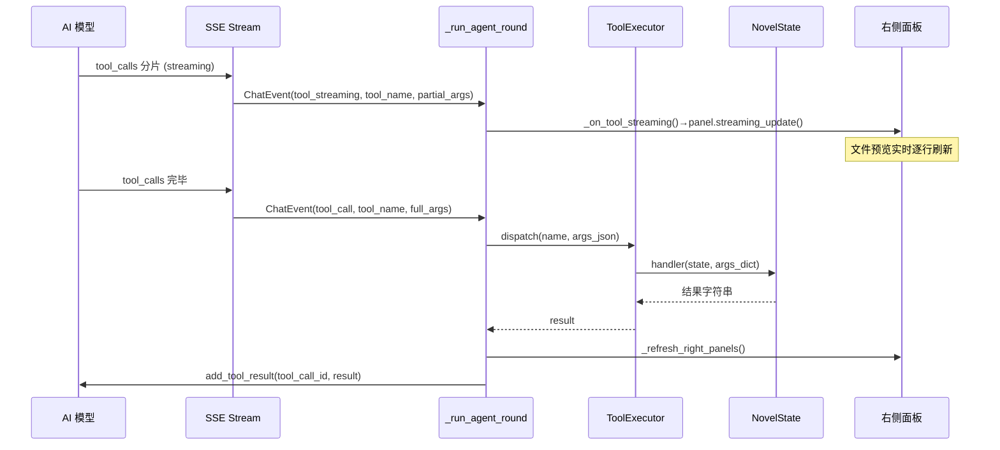

# K.A-purn-tui — 工具系统 & 上下文管理详解

> 面向模型和开发者的完整工具参考文档。涵盖全部 17 个工具的参数、行为、UI 反馈、以及上下文三档水位管理机制。

---

## 工具分类总览

```
┌──────────────────────────────────────────────────────┐
│                    17 个创作工具                       │
├──────────────┬──────────────┬───────────┬─────────────┤
│  章节管理 (4) │  待办计划 (3) │ 文件操作 (7)│ 记忆回读 (4)│
│  chapter_tools│  todo_tools  │ file_tools │memory_tools │
├──────────────┴──────────────┴───────────┴─────────────┤
│               executor.py → ToolRegistry              │
│     dispatch(name, args_json) → handler(state,args)   │
└──────────────────────────────────────────────────────┘
```

---

## 一、章节管理工具（chapter_tools）

### `set_chapter_count`

| 属性 | 值 |
|------|-----|
| 参数 | `count` (int, 必填) — 总章数 |
| 返回值 | `"已设定总章数: {n}"` |
| UI 反馈 | 右侧 ChapterPanel 刷新为 N 章列表，默认标题"第N章" |

> 开始创作时必须首先调用。会自动扩展/收缩 `chapters` 列表，并重置所有已完成标记。

### `set_current_chapter`

| 属性 | 值 |
|------|-----|
| 参数 | `index` (int, 必填) — 1-based 章节序号；`title` (string, 可选) — 章节标题 |
| 返回值 | `"正在写第 {n} 章: {title}"` |
| UI 反馈 | ChapterPanel 高亮当前章；顶栏更新章节信息 |

> 每次切换章节时必须调用。会撤销该章的完成状态（方便重新编辑）。

### `mark_chapter_done`

| 属性 | 值 |
|------|-----|
| 参数 | `index` (int, 必填) — 1-based 章节序号 |
| 返回值 | `"第 {n} 章已标记完成"` |
| UI 反馈 | ChapterPanel 打勾；若 `auto_summarize_on_chapter_done=true`，后台生成章节摘要注入 system prompt |

### `set_progress`

| 属性 | 值 |
|------|-----|
| 参数 | `current` (int, 必填) — 当前进度值；`total` (int, 必填) — 总数；`label` (string, 可选) — 进度标签 |
| 返回值 | `"进度: {current}/{total} ({pct}%) - {label}"` |
| UI 反馈 | 顶栏进度条实时更新（▓/░ 12格） |

> **高频工具**——写正文每 500-1000 字、任何待办变更后必须调用。用户盯着进度条看。持久化到 `.Project/project_state.json`。

---

## 二、待办/计划工具（todo_tools）

### `update_todo`

| 属性 | 值 |
|------|-----|
| 参数 | `items` (array, 必填) — 对象数组，每项 `{text, done?, status?}` |
| 参数详情 | `text` string(必填) 待办内容；`done` bool 是否完成；`status` enum `"pending"|"active"|"done"` |
| 返回值 | `"待办已更新（{n} 项）"` |
| UI 反馈 | 右侧待办面板刷新；`status="active"` 的项在顶栏显示黄色指针 `▸` |

> **整体替换**待办列表（非追加）。当前正在执行的任务设 `status: "active"`（同时只能有一项 active）。待办名称 `text` 禁止使用表情符号。

### `add_todo_item`

| 属性 | 值 |
|------|-----|
| 参数 | `text` (string, 必填) — 待办内容 |
| 返回值 | `"已追加待办: {text}"` |
| UI 反馈 | 待办面板新增一行 |

### `complete_todo_item`

| 属性 | 值 |
|------|-----|
| 参数 | `index` (int, 必填) — 0-based 序号 |
| 返回值 | `"待办已完成: {text}"` |
| UI 反馈 | 待办面板该项标记完成（从 active 列表中移除） |

---

## 三、文件操作工具（file_tools）

所有路径相对于小说项目根目录，自动沙箱校验防越权。

### `create_novel_folder`

| 属性 | 值 |
|------|-----|
| 参数 | `path` (string, 必填) — 相对目录路径 |
| 返回值 | `"已创建文件夹: {path}"` |
| UI 反馈 | 文件树自动刷新 |

> 自动创建父目录（`parents=True`），已存在则跳过。

### `create_novel_file`

| 属性 | 值 |
|------|-----|
| 参数 | `path` (string, 必填)；`content` (string, 可选) — 初始内容 |
| 返回值 | `"已创建文件: {path}"` 或 `"文件已存在: {path}"` |
| UI 反馈 | 文件预览面板切换到 model 模式显示该文件；文件树刷新 |
| 流式预览 | ✅ 支持 (`_STREAMING_TOOLS`) |

> 文件已存在时不覆盖（与 `write_file` 区别）。适合创建章节文件骨架。

### `write_file`

| 属性 | 值 |
|------|-----|
| 参数 | `path` (string, 必填)；`content` (string, 必填) — 完整内容 |
| 返回值 | `"已写入文件: {path}（{n} 字）"` |
| UI 反馈 | 文件预览切换 model 模式；文件树刷新 |
| 流式预览 | ✅ 支持 |

> 覆盖写入。**不推荐用于写章节正文**——模型应使用 `append_to_file` 分段追加，让用户实时看到文字增长。

### `append_to_file`

| 属性 | 值 |
|------|-----|
| 参数 | `path` (string, 必填)；`text` (string, 必填) — 追加文本 |
| 返回值 | `"已追加到 {path}（+{n} 字，共 {total} 字）"` |
| UI 反馈 | 文件预览实时流式增长 |
| 流式预览 | ✅ 支持 |

> **写章节正文的核心工具**。分段追加→读取已有内容→拼接→写入。右侧面板实时显示。

### `edit_file`

| 属性 | 值 |
|------|-----|
| 参数 | `path` (string, 必填)；`mode` (enum, 必填) — `replace|lines|insert_after` |
| 参数详情 | **replace 模式**: `find`(必填), `replace`(必填)；**lines 模式**: `start_line`(int), `end_line`(int), `text`；**insert_after 模式**: `after_line`(int), `text` |
| 返回值 | `"已编辑 {path}（{info}，现 {n} 字）"` |
| 流式预览 | ✅ 支持 |

> 增量编辑，避免重写整个文件。三种模式互斥。

### `delete_file`

| 属性 | 值 |
|------|-----|
| 参数 | `path` (string, 必填) |
| 行为 | 立即移动文件到 `.pr/pre-delete/` 预删除区域 |
| 返回值 | `"[预删除] 已移动 {path} → .pr/pre-delete/{name}（共 {n} 个预删除文件）..."` |

> **文件立即可读**——预删除区域的路径为 `.pr/pre-delete/文件名`，模型可通过 `read_file` 继续读取。
>
> 对话结束后用户回复 `"确认删除"` → 回收站；回复其他 → 恢复原位；无响应 → 留在预删除区。

### `read_file` / `read_project_file`

| 属性 | 值 |
|------|-----|
| 参数 | `path` (string, 必填)；`max_chars` (int, 可选, 默认 0=全文) |
| 返回值 | 文件内容字符串 |
| 特殊能力 | 可读取 `.pr/pre-delete/` 下的预删除文件；`.Project/` 下的计划文件 |

> 两个工具完全相同（`read_project_file` 为兼容保留）。

### `rename_file`

| 属性 | 值 |
|------|-----|
| 参数 | `path` (string)；`new_name` (string, 纯文件名不含路径) |
| 返回值 | `"已重命名: {old} → {new}"` |

### `move_file`

| 属性 | 值 |
|------|-----|
| 参数 | `path` (string)；`dest_dir` (string, 目标目录需已存在) |
| 返回值 | `"已移动: {src} → {dest}/{name}"` |

### `list_project_files`

| 属性 | 值 |
|------|-----|
| 参数 | `directory` (string, 默认 `".Project"`)；`max_lines` (int, 默认 `8`) |
| 返回值 | 目录下 `.md` 文件名 + 前 N 行简介 |

> 用于浏览计划文件、设定文件等。`.Project/plans_index.md` 自动维护索引。

---

## 四、常驻记忆与按需回读（memory_tools）

### Layer 1 — 常驻记忆维护

这四个工具写入的信息会**序列化注入 system prompt**，永久保留、不被上下文裁剪。

| 工具 | 参数 | 返回值 |
|------|------|--------|
| `update_character_card` | `name`(必填), `role`, `traits`, `appearance`, `relations` | `"已更新人物卡: {name}"` |
| `update_world_setting` | `category`(必填), `content`(必填) | `"已更新世界观设定: {category}（{n} 字）"` |
| `update_outline` | `chapters`(必填) — `[{index, summary}]` 数组 | `"大纲已更新（{n} 章）"` |
| `update_style_guide` | `text`(必填) | `"写作风格已更新（{n} 字）"` |

> 执行后自动 `_init_system_prompt()` 刷新注入。空字段不覆盖已有值（`update_character_card`）。

### Layer 2 — 章节摘要

`mark_chapter_done` 后若 `auto_summarize_on_chapter_done=true`，后台 worker 调用模型生成章节摘要，存入 `chapter_summaries` 并注入 system prompt。

### 按需回读

| 工具 | 参数 | 返回值 |
|------|------|--------|
| `read_chapter` | `index`(必填), `start_line?`, `end_line?` | 章节正文内容（可指定行范围） |
| `read_memory` | `category`(必填) — `characters|world_settings|outline|style_guide|chapter_summaries` | 格式化记忆文本 |

> **按需读取不占用上下文**——这些工具只回传内容到当前轮，不将其写入消息历史。参考前文时使用，避免记忆幻觉。

---

## 五、工具执行流程



### 关键机制

1. **流式预览** — `append_to_file` / `write_file` / `create_novel_file` / `edit_file` 的参数分片累积时，通过 `_STREAMING_TOOLS` 集合触发实时文件预览更新。
2. **工具执行后刷新** — 每次 `dispatch` 后立即 `_refresh_right_panels()`，更新章节进度、待办状态、文件树、预览等。
3. **常驻记忆刷新** — `_MEMORY_TOOLS` 集合（character_card/world_setting/outline/style_guide）执行后立即 `_init_system_prompt()` 注入最新记忆。
4. **项目状态持久化** — 章节结构变更（set_chapter_count/set_current_chapter/mark_chapter_done/set_progress）后立即 `ProjectStateStore.save_from_state()`。
5. **会话同步** — 每个工具执行后 `_sync_current_session()`，防止中途崩溃丢失工具修改的待办/记忆/进度。

---

## 六、上下文管理三档水位

### 水位体系

```
占用比例 = (历史消息 token + 工具定义 token) / context.max_tokens

    0% ─────────────────────────────── 60%  正常  无需操作
   60% ─────────────────────────────── 80%  警戒  compact
   80% ─────────────────────────────── 90%  压缩  summarize
   90% ────────────────────────────── 100%  紧急  truncate
```

### 各水位处理策略

| 水位 | 触发条件 | 操作 | 执行方式 |
|------|---------|------|---------|
| 正常 | ratio < 0.6 | 无 | — |
| 警戒 | 0.6 ≤ ratio < 0.8 | 删除旧 reasoning_content；精简 tool result 至 80 字；精简 tool_calls arguments 中 text/content 字段至 50 字 | 同步（即时） |
| 压缩 | 0.8 ≤ ratio < 0.9 | 保留最近 `sliding_window_rounds` 轮消息；调用模型生成早期对话摘要注入 system prompt；删除早期原文 | 异步（worker） |
| 紧急 | ratio ≥ 0.9 | 仅保留 system 消息 + 最近 `sliding_window_rounds * 3` 条消息 | 同步（即时强制） |

### 相关配置项

| 配置 | 默认值 | 说明 |
|------|--------|------|
| `context.max_tokens` | `1000000` | 上下文窗口总容量 |
| `context.warn_threshold` | `0.6` | 警戒水位比例 |
| `context.compress_threshold` | `0.8` | 压缩水位比例 |
| `context.critical_threshold` | `0.9` | 紧急水位比例 |
| `context.sliding_window_rounds` | `6` | 压缩/截断时保留的最近轮数 |
| `context.auto_compact_tool_results` | `true` | 是否自动精简 tool result |
| `context.auto_summarize_on_chapter_done` | `true` | 完成章节后是否自动生成摘要 |

### Token 估算机制

- 使用 **DeepSeek V3 官方 tokenizer**（HuggingFace `tokenizers` 库）精确计数
- 计数范围：`content` + `tool_calls[].function.arguments` + `reasoning_content`
- 工具定义的 token 数也纳入比例计算（`_tool_tokens`）

### 每轮 Token 追踪

每轮 `_run_agent_round` 结束后，聊天区输出：

```
[sys] ++ ~1,234 tokens | context: 461,959/1,000,000 (46.20%)
```

显示本轮新增 token 数（绿色 `++`）、上下文当前占用（黄色 `context:`）、百分比精确到小数点后 2 位。

---

## 七、流式文件预览原理

### 问题

`RichLog.write()` 每次调用**必定创建新显示行**，无法在同一行内追加文本。

### 解决方案：清空 + 按 `\n` 拆行全量重写

```
每次 streaming_update() 执行：
  1. 清空 RichLog
  2. 将当前完整内容按 \n 拆行
  3. 逐行 write()（最后一行即使是未完结尾也直接写出）
  4. richLog.refresh()
```

### 性能

流式内容通常几百到几千字，每次重写开销在毫秒级。每个 `tool_streaming` 事件后 `await asyncio.sleep(0)` 出让控制权，确保 Textual 帧刷新。

---

## 八、预删除文件系统

```
模型调用 delete_file(path)
    ↓
文件立即移动到 .pr/pre-delete/ 目录
    ↓
模型可通过 read_file('.pr/pre-delete/文件名') 继续读取
    ↓
┌─ 用户回复 "确认删除" → perform_delete()
│   所有预删除文件 → 系统回收站（send2trash 或 .trash/ 兜底）
│
├─ 用户回复其他内容 → restore_pre_deleted()
│   所有预删除文件 → 恢复原位
│
└─ 用户无响应 → 文件留在 .pr/pre-delete/
```

---

## 九、扩展：新增工具

```python
# 1. 在 tools/xxx_tools.py 中定义 handler
def _my_tool(state: NovelState, args: dict[str, Any]) -> str:
    # 操作 state ...
    return "结果字符串"

# 2. 创建 ToolDef
MY_TOOL_DEF = ToolDef(
    name="my_tool",
    description="工具描述",
    parameters={
        "type": "object",
        "properties": {"param1": {"type": "string"}},
        "required": ["param1"],
    },
    handler=_my_tool,
)

# 3. 在 executor.py build_novel_registry() 中注册
reg.register(MY_TOOL_DEF)

# 4. （可选）若需要流式预览
#     在 api/client.py _STREAMING_TOOLS 中添加 "my_tool"
#     在 app.py _on_tool_streaming() 中添加提取逻辑
```

---

## 相关文档

- [README.md](../README.md) — 项目说明
- [ARCHITECTURE.md](ARCHITECTURE.md) — 系统架构设计
- [config_guide.md](../config_guide.md) — 配置文件详解
